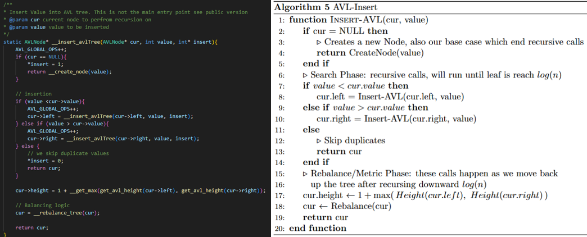
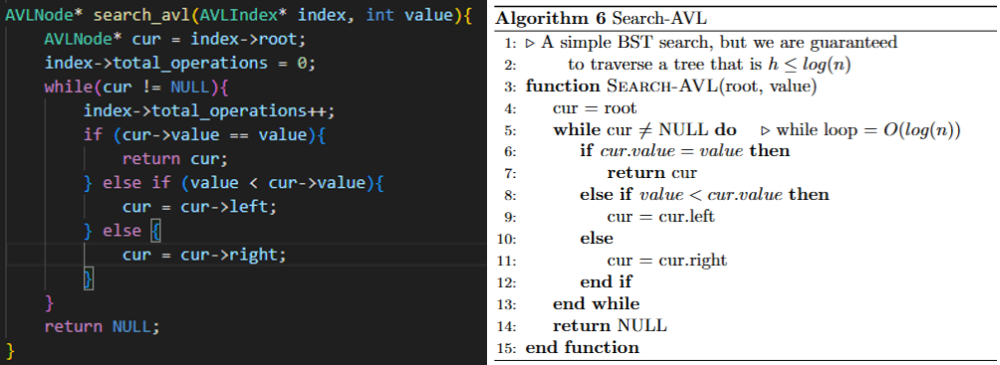
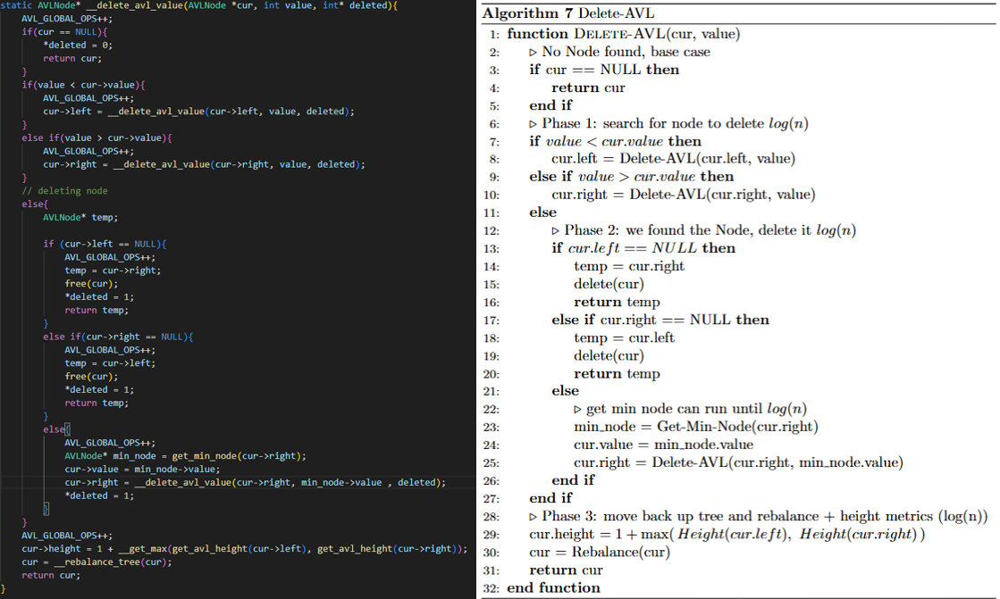
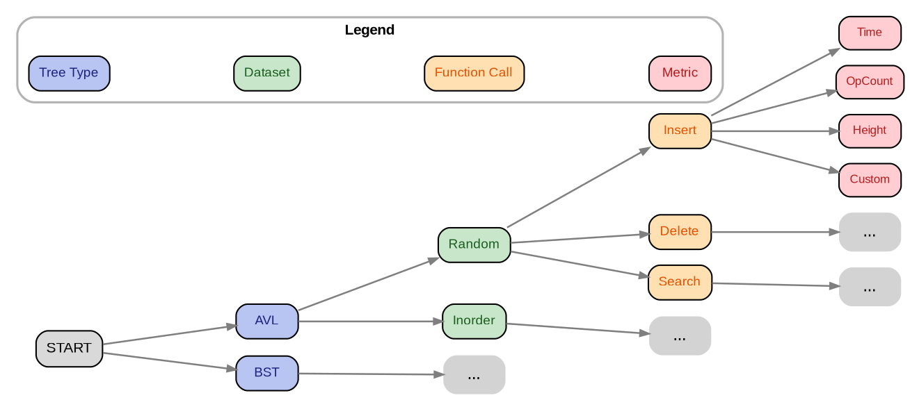
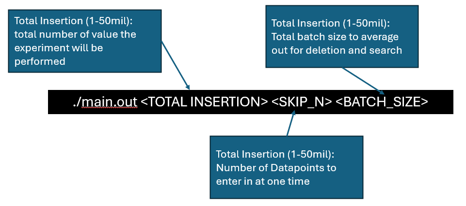

<h1>AVL Tree</h1>

* Name: Joshua Roberge
* Semester: Fall 2025
* Topic: AVL Tree

&nbsp;&nbsp;&nbsp;&nbsp;
A traditional binary search tree (BST) is a data structure that, on average, provides $\log(n)$ for insertions, deletions, and searching, but our worst-case runtime is significantly worse than this. A BST has a significant flaw in that its performance is dependent on insertion order. When a binary tree is unbalanced, its performance is affected and can result in a worst-case scenario of O(n) for numerous operations.

&nbsp;&nbsp;&nbsp;&nbsp;
This research reviews and analyzes the AVL data structure. An AVL is a self-balancing tree that ensures a BST has a height of $O(\log(n))$. To understand the effectiveness of this algorithm, our research will be discussed in four sections:

1. __AVL Data Structure__: A general discussion of the core concepts behind the algorithm and its practical implementations.
2. __Theoretical Analysis__: Showing $h = O(\log(n))$ and then analyzing Big(O) for insertion, deletion, and searching.
3. __Implementation/Experimentation__: A discussion of the report's code base and experiment design.
4. __Empirical Analysis__: analyzing the runtimes using our experimental data.

## AVL Data Structure
&nbsp;&nbsp;&nbsp;&nbsp;
In 1962, a pair of Soviet mathematicians, Georgy Adelson-Velsky and Evgenii Landis, sought to create a data structure that guaranteed $O(\log(n))$ performance for deletion, search, and insertion[1]. To reach this goal, they needed a tree that was as dense as possible. This idea of a dense tree is what can be referred to as a balanced tree. A balanced tree is a tree whose height at the root node is no larger than $log(n)$ [3]. As previously discussed, when we have this property, a BST is guaranteed to achieve  $O(\log(n))$ performance, but a traditional BST is not guaranteed to be balanced. To solve this issue, our Soviet mathematicians created the AVL tree, which is a self-balancing binary search tree.

&nbsp;&nbsp;&nbsp;&nbsp;
Today, the AVL tree has a rich history of practical application.  For example, Linux kernel before 2.4.10 used AVL trees for tracking virtual memory areas. Linux also uses AVL trees for its peer cache tracking system. Generally, AVL trees are used in system operating kernels and other system software. AVL trees are foundational to computer science because they have characteristics that are both practical and useful. In particular, this data structure should be used if data is often inserted in order or if retrieval and deletion are random [4].

&nbsp;&nbsp;&nbsp;&nbsp;
As discussed, this data structure is practical, but how does it achieve this? To gain an understanding of an AVL tree, we are going to discuss two topics: 

* _Identifying Imbalance_: how an AVL tree identifies imbalance
* _Rotation_: how an AVL tree corrects for this imbalance.

### Identifying Imbalance

&nbsp;&nbsp;&nbsp;&nbsp;
Figure 1 outlines some fundamental properties of an AVL tree. Each node in an AVL tree stores its height, or simply put, the length of the longest path beneath it.  With the height of a node, we can then calculate a node’s  balance factor ($B_F$), which is the difference in the height of a node's left and right subtrees. When a $B_F$ is positive, our left subtree is taller, and when it is negative, our right subtree is taller. We use $B_F$ to identify imbalance within our tree, and if $|B_F| > 1$ we correct for this imbalance. When an AVL tree is constrained to this property, we are guaranteed to have a height of $O(log(n))$.  To maintain the property of $|B_F| \le 1$, an AVL tree performs an operation called a rotation.

### Rotations

&nbsp;&nbsp;&nbsp;&nbsp;
To correct for an imbalance in an AVL tree, we perform something called a rotation. Rotations rearrange nodes so that the balance factor constraint is maintained. Rotations have constant time and space complexity, which makes them cheap to perform. There are two types of single rotations L (left), and R(right), and two types of double rotations LR (left-right), and RL (right-left). Below, we discuss each type of rotation and the types of imbalances it corrects.

#### Single Rotations:

&nbsp;&nbsp;&nbsp;&nbsp;
The above figure shows the process for a right rotation. Left and right rotations are inversely related, and thus, fundamentally, their core logic is the same. Since these rotations are logically equivalent, we will just cover a right rotation. For an example of a left rotation, please see the <a href="#left-rotation">appendix (Left Rotation)</a>. A right rotation is triggered by a left imbalance in the tree . Looking at the diagram above, we find that Node 3 has a $B_F \ge 1$  and Node 2 has a $B_F \ge 0$. Under these conditions, we trigger the process of a right rotation. The Pseudo code above walks through this process step-by-step, but simply put, Node 2 becomes the new root node in this process, with node 3 being reassigned as its right child.

#### Double Rotations:

&nbsp;&nbsp;&nbsp;&nbsp;
When we have an imbalance that has a zigzag pattern, we perform either a left-right (LR) or a right-left (RL) rotation. The diagram above outlines an LR rotation, and in the appendix, you’ll find similar logic for an <a href="#right-left-rotation">RL rotation </a>. An LR rotation is triggered by two conditions: condition one, the parent node has a $B_F>1$; and condition two, the parent node’s left child has a $B_F<0$. To fix this imbalance, we perform two steps:
•	Step One: Flatten the zigzag by performing a left rotation. 
•	Step Two: Correct the imbalances by performing a right rotation.

## Theoretical Analysis:

&nbsp;&nbsp;&nbsp;&nbsp;
In this section, we will perform a theoretical runtime analysis for an AVL tree. To accomplish this, our main objective will be to show that the height of an AVL tree is bounded by $O(log(n))$. After proving that our tree height is constrained, we will subsequently rely on this fact and then show that the functions search, deletion, and insertion have  $T(n) = O(log(n))$.

### Proving AVL’s Height

&nbsp;&nbsp;&nbsp;&nbsp;
In this section, we aim to prove, using strong induction, that the height ($h$) of an AVL tree is $O(log(n))$. We will break this section down into two subsections. The first section will present our proof, which relies on the previous work by Goodrich, Moshiri and Mount (cite, cite, cite). In the subsequent section, we will have a detailed discussion of our proof.

#### Proof:
Let $N_h$ be the minimum number of nodes in an AVL tree of height $h$. We claim that
$$
\forall\, h \ge 0,\quad h \le O(\log(n)).
$$

To prove this claim, we first define the recursive relationship, then derive the upper bound of $N_h$, and finally finish by showing the's upper bound of $h$. When taken together, these steps will show that $ h_n \le \mathcal{O}(\log(n))$

__Recursive Relationship__

 Let $N_L$ and $N_R$ be the minimum number of nodes for $N_h$'s left and right subtree. $N_h$ can be defined as a sum of $N_h = N_{L} + N_{R} +1$ (+1 is for the connecting edge). Since we are dealing with the worst-case scenario and  we are constrained by our AVL's balance factor ($|B_F| \leq 1$), we derive the following relationship:
$$
 N_L = N_{h-1} \text{, }
 N_R = N_{h-2}
$$
 thus,

 $$
  N_h = N_{h-1} + N_{h-2} + 1
 $$

__Proof by Strong Induction (Proving $N_h$'s Lower Bound):__

_Base Cases_
- $N_1 = 1$, One root node
- $N_2 = 2 \ge 2^{\frac{2}{2}} $: One root node and child
- $N_3 = N_1 + N_2 + 2 = 2+1+1=4 \ge 2^{\frac{2}{2}} $: using the defined recursive relationship

_Inductive Hypothesis:_ Assume $k \ge 3$ and $\forall h$ s.t. $2 \ge h \le k$ that $N_h \ge 2^{\frac{h}{2}}$\\

_Inductive Step:_
$$
\begin{align*}
N_{k+1} &= N_k + N_{k-1} + 1\\
        &> N_{k-1} + N_{k-1} + 1
        \quad\text{($N_k$ to $N_{k+1}$ and $1$ to $0$... lower bound)}\\
        &> 2 \cdot N_{k-1}\\
        &> 2 \cdot 2^{(k-1)/2}
        \quad\text{(Inductive Hypothesis)}\\
        &> 2^{1 + (k-1)/2}\\
        &> 2^{(k+1)/2}
\end{align*}
$$
thus: $N_{k+1} \ge 2^{\frac{k+1}{2}}$

_conclusion_: $N_h \ge 2^{\frac{h}{2}}$ $\forall h\ge 2$

 __h's Upper Bound:__

Taking the relationship derived above, we can derive $h$'s upper bound
$$
\begin{align*}
    N_h &> 2^{h/2}\\
    \log_2(N_h) &> \frac{h}{2}\\
    h &< 2\log_2(N_h)
\end{align*}
$$

__Conclusion:__

Since $n \ge N_h$ and $h < 2\log_2(N_h)$, thus $h = \mathcal{O}(\log n)$.

#### Proof Discussion:
&nbsp;&nbsp;&nbsp;&nbsp;
The proof above shows that the height of an AVL tree is bounded by $O(\log(n))$. We were able to come to this conclusion by combining the proofs  of Goodrich, Moshiri, and Mount (cite, cite, cite). Upon studying their proofs, it was revealed that solving for height ($h$) was more difficult than solving for the minimum number of nodes under a specific height ($N_h$). If we can show that $N_h$ grows exponentially as $h$ increases, we can reverse this relationship and thus show $h = O(\log(n))$.

&nbsp;&nbsp;&nbsp;&nbsp;
This idea of defining the lower bound $N_h$ is foundational to our proof. We rely on $N_h$ because this provides the least amount of restraint on the growth of $h$.  Meaning, if $N_h$ still grows exponentially, then anything above this is still greater than or equal to exponential growth. Given the relationship between the growth of $N_h$ and the growth of $h$, we were able to solve for the upper bound of $h$ in a three-step process:

__Step One: Define the Recursive Relationship__

$$

  N_h = N_{h-1} + N_{h-2} + 1

$$
&nbsp;&nbsp;&nbsp;&nbsp;
The above equation defines $N_h$ recursively by summing the nodes of the left and right trees plus the parent node. As previously discussed, an AVL tree’s height is bounded by the balancing factor, which states that $|B_f| \le 1$. Given this constraint, the left and right trees of $N_h$ can at most have a one-level difference. This information allows us to define $N_h$ recursively.

__Step Two: Lower Bound of $N_h$:__

&nbsp;&nbsp;&nbsp;&nbsp;
Moshiri’s proof uses a direct proof via algebraic manipulation to show the lower bound of $N_h$ (cite). Our proof took a slightly different route, where we decided to use strong induction like Goodrich (cite). In our proof, take note that we are able to simplify $N_k + N_{k-1} + 1$ to $ 2N_{k-1}$. We are able to do this because $N_k + N_{k-1} + 1 > 2N_{k-1}$, and thus still allows us to solve the looser lower bound of $N_h$. This step allowed us to simplify the process for solving for $N_h$, but it is worth mentioning that Mount did not take this step. In Mount’s proof, he was able to obtain a tighter bound for $N_h$  using the golden ratio and the Fibonacci sequence.

__Step Three: Upper Bound of $h$__

&nbsp;&nbsp;&nbsp;&nbsp;
With the strong induction proof in hand, it was now time to solve for the upper bound of $h$. We were able to show the upper bound of $h$ with simple algebraic manipulation. After manipulating $N_h > 2^{h/2}$, we were able to find that $h < 2\log_2(N_h)$. Using asymptotic notation, we were able to conclude:

$n \ge N_h$ and $h < 2\log_2(N_h)$, thus $h =O(\log (n))$

### Big-O for Insertion, Deletion and Search

| Function | Time Complexity | Space Complexity (iterative) | Space Complexity (recursive) |
|----------|-----------------|------------------------------|------------------------------|
| Insertion | $O(\log(n))$ | $O(1)$ | $O(\log(n))$ |
| Search | $O(\log(n))$ | $O(1)$ | $O(\log(n))$ |
| Delete | $O(\log(n))$ | $O(1)$ | $O(\log(n))$ |

&nbsp;&nbsp;&nbsp;&nbsp;
The table above outlines the runtimes for insertion, deletion, and search. These runtimes are made possible because an AVL tree’s height is $O(log(n))$ (see proof); This means, the cost of traversing to a leaf node will also be $O(\log(n))$. To explain and validate the above runtimes, we will walk through each of the functions’ pseudocode and then explain there time and space complexity.

#### Insertion:

$$
T(n) = T_{Search}(\log(n)) + T_{RebalanceHeight}(\log(n)) = 2\cdot \log(n) = O(log(n))
$$

&nbsp;&nbsp;&nbsp;&nbsp;
The above code outlines a recursive definition of our AVL insert function. We can break down this pseudocode into two phases. In the first phase, we search for a location to insert our new value. The search phase ends once we hit a leaf node, and we know this traversal will have $O(\log(n))$ due to our height. Once we hit our leaf node, we will enter phase two: `RebalanceMetrics`. In this phase, we move back up our tree, while updating our height and rebalancing the tree if needed. In this phase, we are guaranteed to make no more than one rotation [CITE]. Note that the best-case, worst-case, and average-case for inserting into an AVL tree are all $O(log(n))$  since we must always traverse to the leaf node and back up again.

&nbsp;&nbsp;&nbsp;&nbsp;
In our code, we used a recursive definition to define AVL’s insert function. Using a recursive definition means that each stack call will contribute to our total memory footprint. We are recursively traversing to our root node, which means $S(n) = O(\log(n))$. This recursive definition for an AVL tree is purely academic because we can define this function iteratively, which would have $S(n) = O(1)$ [Cite].

#### Search:

$$

T(n) = T_{search}(\log(n))

$$

&nbsp;&nbsp;&nbsp;&nbsp;
The above code outlines our definition for searching an AVL tree. We start off with a `while` loop, which iterates until we find our search value. Given the worst-case scenario, we must traverse to the leaf node, which would be $O(\log(n))$. Looking beyond a worst-case scenario, our best-case would be $O(1)$, which assumes we find our value in the root node. Our average-case would traverse halfway down the tree, which would still be a factor of $log(n)$ .

&nbsp;&nbsp;&nbsp;&nbsp;
Our search function uses an iterative approach. As shown in the above code, this approach’s space complexity remains constant through each loop, thus resulting in $S(n) = O(1)$. This function could be accomplished using recursion, which would result in a space complexity of $S(n) = O(log(n))$.

#### Deletion:

$$

T(n) = T_{Search}(\log(n)) + T_{FindReplacement}(\log(n)) + T_{MetricsRotations}(\log(n)) = 3\cdot \log(n) = O(log(n))

$$

&nbsp;&nbsp;&nbsp;&nbsp;
The above code outlines our process for deleting a value from an AVL tree. To accomplish this goal, our code iterates through three distinct phases. In the first phase, we move down to the node we want to delete, which under the worst-case, would be $O(log(n)) = O(h)$. Once we find the value to delete, we move into phase two. The goal of phase two is to find a replacement value for our deleted node. To find a replacement value, we will find the minimum value in the deleted node's right subtree. After finding this node, we move it to the deleted node’s location. This operation, under a worst-case scenario, contributes $O \log(n)$ to our runtime. In our third and final phase, we move back up our tree, while recalculating height and performing any necessary rotations. Unlike insertion, which at most can cause two rotations, deleting can have a cascading effect, which will cause $log(n)$ rotations. Taken together, we arrive at a worst-case scenario of  $O(log(n))$, which is outlined in the equation above. Since we must always find a replacement node in this process, which is $O(log(n))$ deep, our best and average case will also be $\log(n)$.

&nbsp;&nbsp;&nbsp;&nbsp;
Our definition of deletion uses recursion, which means each recursive call contributes to our overall memory footprint. Each individual recursive call uses $O(1)$ space, and thus we need only to account for the total stack depth, which is:

$$

S(n) = StackDepth = O(log(n))

$$

&nbsp;&nbsp;&nbsp;&nbsp;
It should be noted that this is a recursive definition for deletion, but there are iterative solutions. If we were to use an iterative solution, we would have $S(n) = O(1)$. To achieve this space complexity, we would need to implement parent pointers for each node, so that we could traverse backwards [6].

## Appendix

### Left Rotation:

### Right-Left Rotation:

## Implementation/Experimental Design

&nbsp;&nbsp;&nbsp;&nbsp;
This section’s purpose is to outline our experimental design and how our C repository was able to get us there. Originally, for this project, we planned to compare different types of binary search trees across various metrics. A week into the project, we quickly realized that our initial plan might have been overzealous, and thus we scaled back to an AVL tree and traditional BST. With this in mind, you will notice that our code follows a reusable template that can be adapted for future projects and experiments.

### Experimental Design

The figure above shows our entire experimental design for this report. As shown above, we were able to perform a significant number of trials across various blocking criteria. This design allowed us to have a comprehensive empirical analysis, and furthermore, gave us room to expand our analysis in the future. Below, we will discuss each type  of experimental block.

__Tree Type:__

For this project, our plan was to compare several types of BSTs, but as mentioned, this was ambitious. Instead of comparing several different BSTs, we ended up comparing an AVL to a traditional binary search tree. We decided to include a traditional BST since it would complement and highlight the benefits of an AVL tree. The traditional BST results can be found in the appendix.

__Datasets:__

For this project, we ran each tree across two datasets. One dataset was completely randomized with numbers between 0-100 million. The other dataset contained the same data points as our randomized dataset, but in sorted order. We chose these two types of datasets because they would highlight the benefits of a self-balancing tree when compared to a traditional binary search tree.

__Function Call:__

We covered three foundational functions for a BST:

* _Insert_: This operation adds a node to the BST.
* _Search_: This operation searches our BST for a given value
* _Delete_: This operation deletes a value from our BST.

__Metrics:__

We tracked three types of metrics for our experiment:

* _Time_: The hardest variable to measure was time. We noticed during our initial experimentation that random noise ended up being the dominating factor for our time variable. To diminish the effects of noise, we ran each experiment in a batch of 1,000, and then took the average result. Given that each run was independent and our residuals were randomly distributed, this should diminish the effects of noise. We did not take the average result for insertion since there will be autocorrelation between every $n$th value inserted, meaning that the $n$th value inserted into our tree will be dependent on $n-1$, $n-2$, and so on. We therefore took the sum of inserting 1,000 data points at a time, which would preserve this dependency and diminish noise.
* _Operation Count_: for each tree, we tracked the total number of operations performed during each function call. Counting operations is tricky and can be considered subjective. Therefore, this metric is great for comparing varying levels of $n$ across the same BST, and shouldn’t be used to compare different types of $BST$’s.
* _Custom_: This metric was a placeholder for a metric specific to the BST in question. For our experiment, we used this placeholder metric to count the number of rotations an AVL tree made during a function call.
* _Height_: This metric tracked the height of the root node.

### Code Structure

&nbsp;&nbsp;&nbsp;&nbsp;
To accommodate our experimental design, we needed a robust code base that was able to accommodate all our metrics. This was no easy feat and took careful planning and plenty of rework. To understand our code, we will discuss our two main modules: trees and benchmarking.

__Trees:__

&nbsp;&nbsp;&nbsp;&nbsp;
Our tree module housed the core components for our traditional BST and our AVL tree. Both of our tree implementations were based on Python code found on the site GeeksforGeeks, which we then converted to C code (CITE)(CITE)(CITE). Using GeeksforGeeks’ Python code provided a starting point and a valuable learning experience. While converting Python to C, we took this opportunity to create a standard framework between our different types of BSTs.

&nbsp;&nbsp;&nbsp;&nbsp;
Each BST contained two public structs, `Node` and `Index`, and four public functions, create_index, search, insert, and delete. Having this common framework allowed us to easily reuse our benchmarking code across our different tree implementations.

&nbsp;&nbsp;&nbsp;&nbsp;
Admittedly, our tree module needs refactoring. Although our AVL and BST share a common framework, due to time, we were unable to create generics for them. Having generics would make our code DRY and would make our implementation more modular.

__Benchmarking:__

&nbsp;&nbsp;&nbsp;&nbsp;
Our benchmarking library housed the logic for tracking our experiments. Each tree was given its own benchmarking script, which was then called by the main script. Each benchmarking script is composed of two private functions:
* `__get_regular_operation_time`: running experiments for searching and deleting data.
* `__get_insertion_time`:  tracks the runtime for inserting values.

To run an experiment, the user needs to call `make main` and then call `./main.out`. If the user desires to control the experimental run, they can pass in additional keyword arguments (see figure above).
