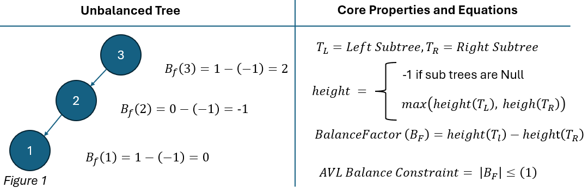
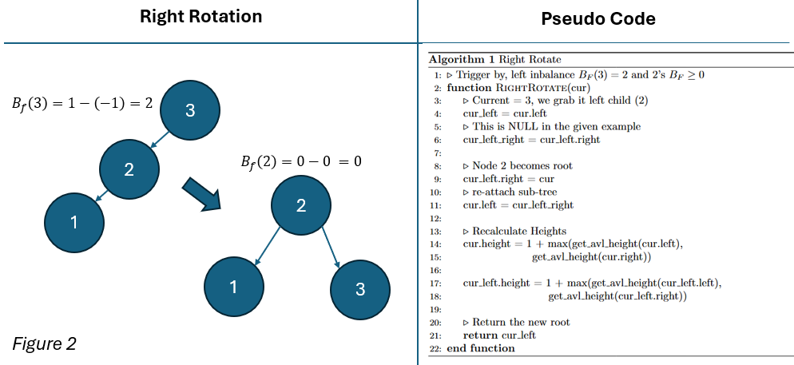
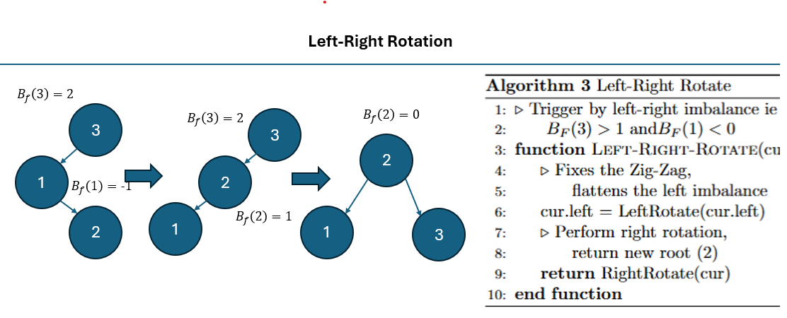
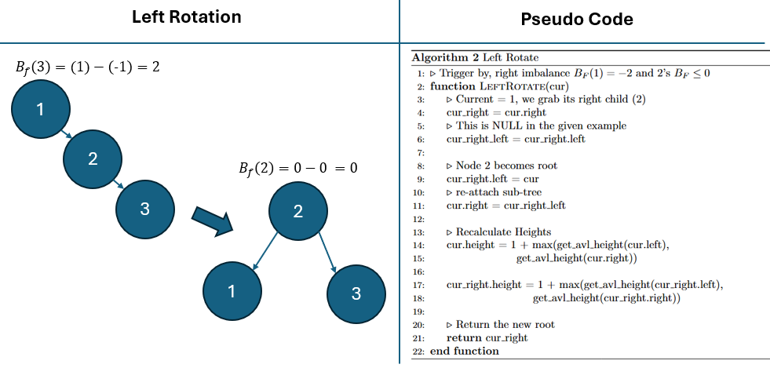
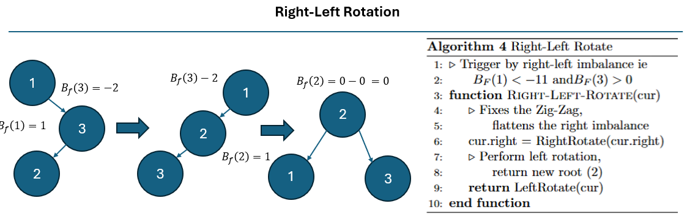

<h1>AVL Tree</h1>

* Name: Joshua Roberge
* Semester: Fall 2025
* Topic: AVL Tree

&nbsp;&nbsp;&nbsp;&nbsp;
A traditional binary search tree (BST) is a data structure that, on average, provides $\log(n)$ for insertions, deletions, and searching, but our worst-case runtime is significantly worse than this. A BST has a significant flaw in that its performance is dependent on insertion order. When a binary tree is unbalanced, its performance is affected and can result in a worst-case scenario of O(n) for numerous operations.

&nbsp;&nbsp;&nbsp;&nbsp;
This research reviews and analyzes the AVL data structure. An AVL is a self-balancing tree that ensures a BST has a height of $O(\log(n))$. To understand the effectiveness of this algorithm, our research will be discussed in four sections:

1. __AVL Data Structure__: A general discussion of the core concepts behind the algorithm and its practical implementations.
2. __Theoretical Analysis__: Showing $h = O(\log(n))$ and then analyzing Big(O) for insertion, deletion, and searching.
3. __Implementation/Experimentation__: A discussion of the report's code base and experiment design.
4. __Empirical Analysis__: analyzing the runtimes using our experimental data.

## AVL Data Structure
&nbsp;&nbsp;&nbsp;&nbsp;
In 1962, a pair of Soviet mathematicians, Georgy Adelson-Velsky and Evgenii Landis, sought to create a data structure that guaranteed $O(\log(n))$ performance for deletion, search, and insertion[1]. To reach this goal, they needed a tree that was as dense as possible. This idea of a dense tree is what can be referred to as a balanced tree. A balanced tree is a tree whose height at the root node is no larger than $log(n)$ [3]. As previously discussed, when we have this property, a BST is guaranteed to achieve  $O(\log(n))$ performance, but a traditional BST is not guaranteed to be balanced. To solve this issue, our Soviet mathematicians created the AVL tree, which is a self-balancing binary search tree.

&nbsp;&nbsp;&nbsp;&nbsp;
Today, the AVL tree has a rich history of practical application.  For example, Linux kernel before 2.4.10 used AVL trees for tracking virtual memory areas. Linux also uses AVL trees for its peer cache tracking system. Generally, AVL trees are used in system operating kernels and other system software. AVL trees are foundational to computer science because they have characteristics that are both practical and useful. In particular, this data structure should be used if data is often inserted in order or if retrieval and deletion are random [4].

&nbsp;&nbsp;&nbsp;&nbsp;
As discussed, this data structure is practical, but how does it achieve this? To gain an understanding of an AVL tree, we are going to discuss two topics: 

* _Identifying Imbalance_: how an AVL tree identifies imbalance
* _Rotation_: how an AVL tree corrects for this imbalance.

### Identifying Imbalance

&nbsp;&nbsp;&nbsp;&nbsp;
Figure 1 outlines some fundamental properties of an AVL tree. Each node in an AVL tree stores its height, or simply put, the length of the longest path beneath it.  With the height of a node, we can then calculate a node’s  balance factor ($B_F$), which is the difference in the height of a node's left and right subtrees. When a $B_F$ is positive, our left subtree is taller, and when it is negative, our right subtree is taller. We use $B_F$ to identify imbalance within our tree, and if $|B_F| > 1$ we correct for this imbalance. When an AVL tree is constrained to this property, we are guaranteed to have a height of $O(log(n))$.  To maintain the property of $|B_F| \le 1$, an AVL tree performs an operation called a rotation.

### Rotations

&nbsp;&nbsp;&nbsp;&nbsp;
To correct for an imbalance in an AVL tree, we perform something called a rotation. Rotations rearrange nodes so that the balance factor constraint is maintained. Rotations have constant time and space complexity, which makes them cheap to perform. There are two types of single rotations L (left), and R(right), and two types of double rotations LR (left-right), and RL (right-left). Below, we discuss each type of rotation and the types of imbalances it corrects.

#### Single Rotations:

&nbsp;&nbsp;&nbsp;&nbsp;
The above figure shows the process for a right rotation. Left and right rotations are inversely related, and thus, fundamentally, their core logic is the same. Since these rotations are logically equivalent, we will just cover a right rotation. For an example of a left rotation, please see the <a href="#left-rotation">appendix (Left Rotation)</a>. A right rotation is triggered by a left imbalance in the tree . Looking at the diagram above, we find that Node 3 has a $B_F \ge 1$  and Node 2 has a $B_F \ge 0$. Under these conditions, we trigger the process of a right rotation. The Pseudo code above walks through this process step-by-step, but simply put, Node 2 becomes the new root node in this process, with node 3 being reassigned as its right child.

#### Double Rotations:

&nbsp;&nbsp;&nbsp;&nbsp;
When we have an imbalance that has a zigzag pattern, we perform either a left-right (LR) or a right-left (RL) rotation. The diagram above outlines an LR rotation, and in the appendix, you’ll find similar logic for an <a href="#right-left-rotation">RL rotation </a>. An LR rotation is triggered by two conditions: condition one, the parent node has a $B_F>1$; and condition two, the parent node’s left child has a $B_F<0$. To fix this imbalance, we perform two steps:
•	Step One: Flatten the zigzag by performing a left rotation. 
•	Step Two: Correct the imbalances by performing a right rotation.

## Theoretical Analysis:

&nbsp;&nbsp;&nbsp;&nbsp;
In this section, we will perform a theoretical runtime analysis for an AVL tree. To accomplish this, our main objective will be to show that the height of an AVL tree is bounded by $O(log(n))$. After proving that our tree height is constrained, we will subsequently rely on this fact and then show that the functions search, deletion, and insertion have  $T(n) = O(log(n))$.

### Proving AVL’s Height

&nbsp;&nbsp;&nbsp;&nbsp;
In this section, we aim to prove, using strong induction, that the height ($h$) of an AVL tree is $O(log(n))$. We will break this section down into two subsections. The first section will present our proof, which relies on the previous work by Moshiri and Mount (cite, cite). In the subsequent section, we will have a detailed discussion of our proof.

## Appendix

### Left Rotation:

### Right-Left Rotation:

